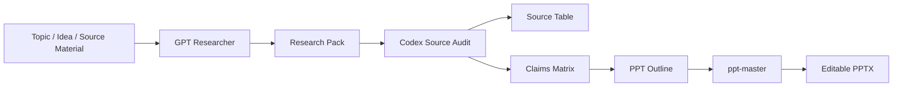

# Evidence To PPT Workflow

<p align="right">
🇨🇳 <a href="README.md">中文</a> | 🇺🇸 <strong>English</strong>
</p>

[](skills/evidence-to-ppt-workflow/SKILL.md)
[](https://github.com/zq88577727/evidence-to-ppt-workflow/actions/workflows/validate.yml)
[](#workflow-overview)
[](LICENSE)
[](#security-notes)

Evidence To PPT Workflow turns a presentation request into a traceable research pack, runs a Codex source audit and claims matrix, then hands approved material to `ppt-master` for slide generation. It works when you only have a topic or idea, and it also works when you already have PDFs, reports, web pages, outlines, or Markdown files that need more evidence, source review, and slide-ready structure.

> This is not an official plugin for GPT Researcher, ppt-master, Tavily, Brave, DeepSeek, or Ollama. It is a local Codex workflow orchestration layer.


## Demo

This lightweight workflow demo shows how outputs appear over time. It is an illustrative demo, not a verified live run. Real runs require configured GPT Researcher provider keys, a retriever/search API, and `ppt-master`.


## What It Is For

- You only have a topic, idea, or question and need research before making slides.
- You already have a PDF, report, web page, outline, or Markdown file, but want to add external evidence, audit sources, build a claims matrix, and then create PPT input.
- You want facts, numbers, and judgments in the deck to point back to sources.
- You want `source_table.csv` and `claims_matrix.md` before slide generation.
- You want Codex to connect GPT Researcher and ppt-master into a repeatable workflow.

## What It Is Not For

- You already have complete, trusted, slide-ready source material and do not need extra research, source review, or a claims matrix. In that case, use `ppt-master` directly.
- You need to bypass paywalls, access controls, or terms of service.
- You need a guarantee that all web material is correct. This workflow reduces risk but does not replace human review.
- You need automatic API key hosting or secret management.

## Core Value

| Stage | Owner | Output | Quality Gate |
| --- | --- | --- | --- |
| Find evidence | GPT Researcher | `01_research_pack.md` | Facts need URLs or DOI-like identifiers; facts, estimates, and analysis stay separate |
| Audit sources | Codex | `02_source_table.csv`, `03_claims_matrix.md`, `05_audit_report.md` | Unsupported claims do not enter the deck |
| Generate slides | ppt-master | PPTX project and final deck | Uses only reviewed material |

## Workflow Overview



Visual assets:

- [assets/hero-workflow.svg](assets/hero-workflow.svg)
- [assets/evidence-gates.svg](assets/evidence-gates.svg)
- [assets/ppt-output-pack.svg](assets/ppt-output-pack.svg)
- [assets/demo-workflow.gif](assets/demo-workflow.gif)

## Quick Start

### 1. Install dependency skills

Install these Codex skills first:

- [GPT Researcher](https://github.com/assafelovic/gpt-researcher)
- [ppt-master](https://github.com/hugohe3/ppt-master)

If you use the `skills` CLI, try:

```bash
npx skills add assafelovic/gpt-researcher@gpt-researcher
npx skills add hugohe3/ppt-master@ppt-master
```

If the CLI installs skills into project-level `.agents/skills` but you want global Codex access, confirm or copy them into `~/.codex/skills`. You should eventually have:

```text
~/.codex/skills/gpt-researcher/SKILL.md
~/.codex/skills/ppt-master/SKILL.md
```

### 2. Install this workflow

Copy the skill folder into the global Codex skills directory:

```bash
mkdir -p ~/.codex/skills
cp -R skills/evidence-to-ppt-workflow ~/.codex/skills/evidence-to-ppt-workflow
```

The folder includes `SKILL.md`, `workflow/contract.json`, and `scripts/validate_workflow_pack.py`, so copying the whole directory preserves the workflow validation loop.

Verify:

```bash
python3 scripts/smoke_install.py --codex-home ~/.codex
```

Restart Codex after installation.

### 3. Example prompts

Start from a topic:

```text
Use evidence-to-ppt-workflow for this topic: AI Agent adoption in small and medium businesses.
The audience is SMB owners. Keep it under 10 slides. The PPT should be in Chinese and every key claim needs a source.
```

Start from existing material:

```text
Use evidence-to-ppt-workflow with this PDF and my existing outline to create a PPT material pack.
First add authoritative external sources, audit every key claim, then prepare the claims matrix and ppt-master input file.
```

Stop before final deck generation:

```text
Use evidence-to-ppt-workflow to create a source-backed material pack and PPT outline for "how generative AI changes consulting delivery models." Do not generate the final PPT yet.
```

## Output Structure


```text
work/evidence-to-ppt/<topic-slug>/
  00_brief.md
  01_research_pack.md
  02_source_table.csv
  03_claims_matrix.md
  04_ppt_outline.md
  05_audit_report.md
  06_ppt_master_input.md
  ppt-master-project/
```

## Claims Matrix Example

Every slide-worthy claim must trace back to evidence:


## Delivery Criteria


A deliverable run should meet these criteria:

- `02_source_table.csv` keeps enough credible A/B-tier sources; the central message does not rely only on C-tier sources.
- Every deck claim in `03_claims_matrix.md` has source IDs, status, and caveats.
- Each slide in `04_ppt_outline.md` points to accepted or caveated evidence.
- `06_ppt_master_input.md` explicitly tells `ppt-master` not to add unaudited factual claims.
- If the user asks for the final deck, the workflow must produce an editable PPTX or a clear blocked reason.

Editable PPTX generation comes from `ppt-master`. This workflow prepares evidence-reviewed inputs so unsupported claims are less likely to enter the deck.

## Validation

Machine-readable hard gates live in [workflow/contract.json](workflow/contract.json), with human-readable notes in [docs/workflow-contract.md](docs/workflow-contract.md).

Run the local validator against the complete public example:

```bash
python3 scripts/validate_workflow_pack.py examples/complete-run
```

It checks required files, source table headers, at least 5 A/B-tier credible sources, evidence bindings for accepted and caveated claims, source bindings for every slide, and the no-new-claims instruction in `06_ppt_master_input.md`.

The `examples/example-*` files are format examples only. [examples/complete-run](examples/complete-run) is the validator-passing complete example.

## API Key And Model Setup

API keys and model settings follow GPT Researcher provider configuration. This workflow does not bind you to one model vendor.

GPT Researcher supports multiple LLM, retriever, and embedding providers. Use the official GPT Researcher docs for exact provider names and model strings. Common options include OpenAI, Anthropic, Azure OpenAI, Google Gemini, Groq, Mistral, Ollama, Together, DashScope, OpenRouter, MiniMax, Bedrock, HuggingFace, LiteLLM, and DeepSeek.

DeepSeek is only one optional example:

```env
DEEPSEEK_API_KEY=
FAST_LLM=deepseek:deepseek-chat
SMART_LLM=deepseek:deepseek-chat
STRATEGIC_LLM=deepseek:deepseek-chat
```

Search can use Tavily, Brave, or another GPT Researcher-supported retriever. Embeddings can use Ollama, local models, or another supported provider.

Copy [.env.example](.env.example) and fill in the provider you choose:

```bash
cp .env.example .env
```

Do not commit `.env` to GitHub.

## Security Notes

- This repository does not contain real API keys.
- `.gitignore` excludes `.env`, `.env.*`, and local secret files.
- Codex should not write API keys into files unless the user explicitly approves the target file.
- API keys are only needed when Phase 1 starts GPT Researcher evidence gathering.
- Users are responsible for upstream costs, quotas, rate limits, and terms of service.

## Dependencies

This workflow orchestrates or references:

- [GPT Researcher](https://github.com/assafelovic/gpt-researcher)
- [ppt-master](https://github.com/hugohe3/ppt-master)
- [Tavily](https://www.tavily.com/)
- [Brave Search API](https://brave.com/search/api/)
- [DeepSeek API](https://api-docs.deepseek.com/)
- [Ollama](https://ollama.com/)

See [NOTICE.md](NOTICE.md).

## FAQ

**Does this automatically prove every source is true?**  
No. It forces source tables and claims matrices so Codex can review support more systematically, but final fact judgment still needs human review.

**Can I avoid DeepSeek?**  
Yes. DeepSeek is only an example. Use any GPT Researcher-supported provider.

**Can I avoid Tavily?**  
Yes. Use Brave or another supported retriever.

**When do I need API keys?**  
Only when Phase 1 starts GPT Researcher evidence gathering. Phase 0 brief creation does not need keys.

**Can I generate only the material pack, not the final PPT?**  
Yes. Say "do not generate the final PPT yet" and the workflow can stop before or around `06_ppt_master_input.md`.

## Roadmap

- [ ] Add optional templates for business analysis, industry research, and academic reporting.
- [ ] Add more provider configuration examples.
- [ ] Add an end-to-end demo output pack.

## License

MIT. See [LICENSE](LICENSE).
