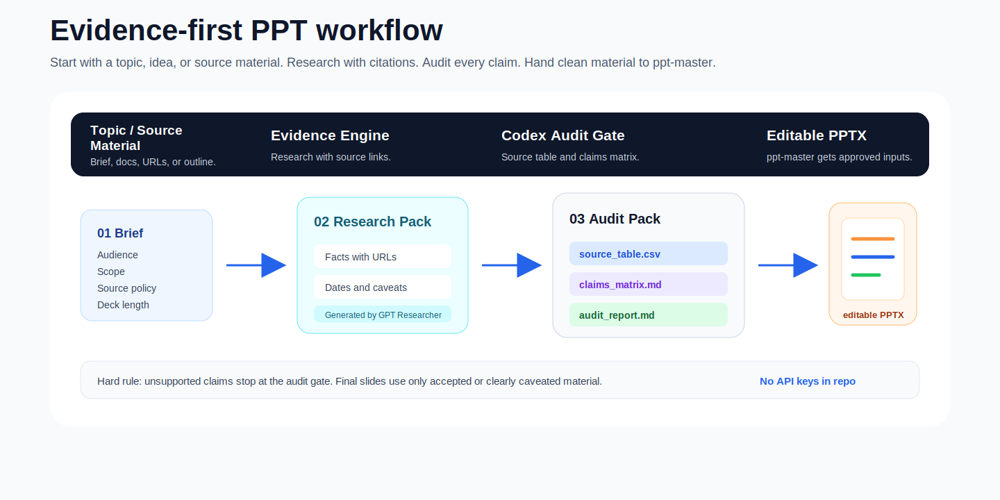
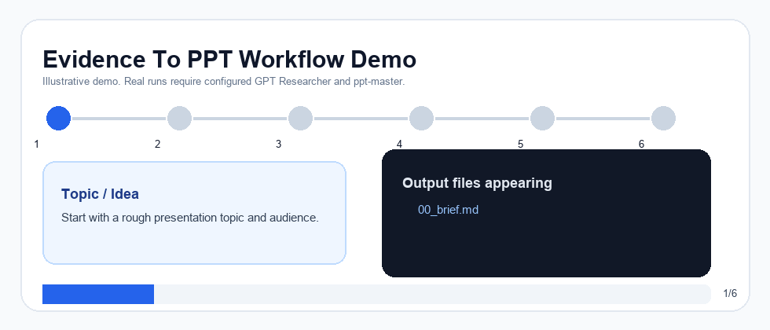
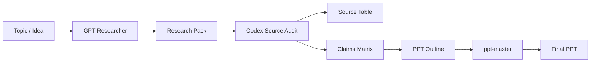
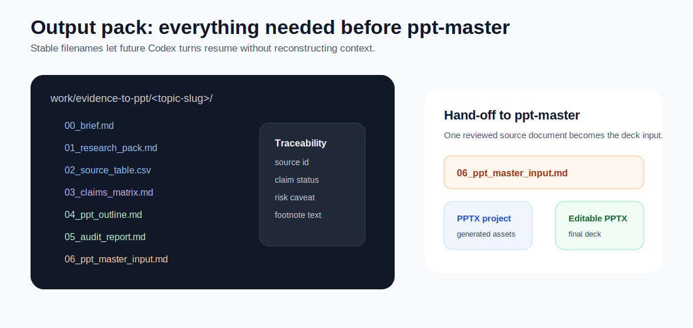
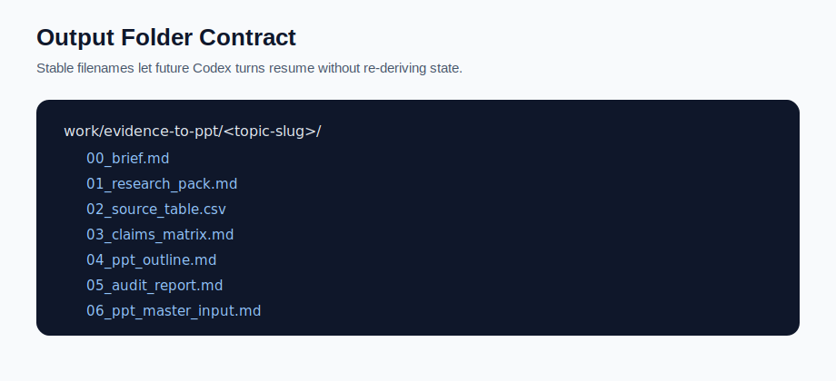
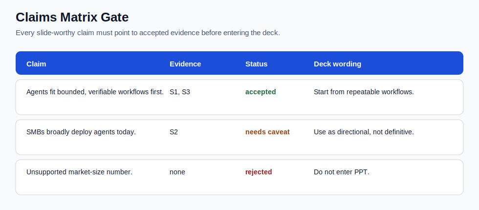
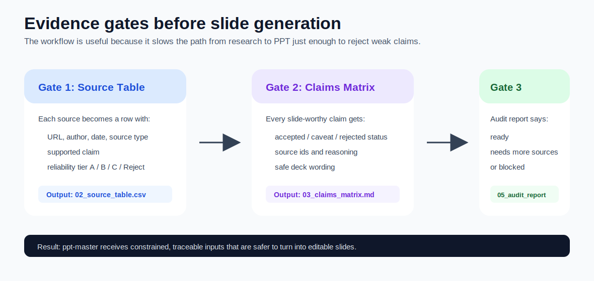

# Evidence To PPT Workflow

[](skills/evidence-to-ppt-workflow/SKILL.md)
[](#工作流总览)
[](LICENSE)
[](#安全注意事项)

把“只有一个主题或想法”的 PPT 需求，先变成可追溯证据材料包，再经过 Codex 来源审查和 claims matrix，最后交给 `ppt-master` 生成演示文稿。

> 本项目不是 GPT Researcher、ppt-master、Tavily、DeepSeek、Ollama 或 Brave 的官方插件。它只是一个本地 Codex workflow 编排层。



## Demo

下面是一个轻量 workflow demo，用于展示产物如何逐步出现。它不是端到端真实运行录屏；真实运行需要先配置 GPT Researcher provider、搜索 API 和 `ppt-master`。



## 适合解决什么问题

- 你只有一个主题，还没有 PDF、报告或提纲。
- 你希望 PPT 中的事实、数据和判断都有来源。
- 你希望在进入 PPT 制作前，先生成 `source_table.csv` 和 `claims_matrix.md`。
- 你想让 Codex 把 GPT Researcher 与 ppt-master 串成一个固定流程。

## 不适合什么问题

- 已经有完整、可信、可直接使用的源文档，只需要做 PPT。此时直接用 `ppt-master`。
- 需要绕过付费墙、访问控制或服务条款抓取内容。
- 需要保证所有网络资料绝对正确。这个 workflow 只能降低风险，不能替代人工审稿。
- 需要自动提交 API key 或托管密钥。

## 核心价值

| 阶段 | 负责方 | 产物 | 质量闸门 |
| --- | --- | --- | --- |
| 找证据 | GPT Researcher | `01_research_pack.md` | 要求事实带 URL/DOI，区分事实、估计和分析 |
| 审来源 | Codex | `02_source_table.csv`、`03_claims_matrix.md`、`05_audit_report.md` | 不支持的 claim 不进 PPT |
| 做 PPT | ppt-master | PPTX 项目和最终 deck | 只使用审查通过的材料 |

## 工作流总览



更多图示见：

- [assets/hero-workflow.svg](assets/hero-workflow.svg)
- [assets/hero-workflow.png](assets/hero-workflow.png)
- [assets/evidence-gates.svg](assets/evidence-gates.svg)
- [assets/evidence-gates.png](assets/evidence-gates.png)
- [assets/ppt-output-pack.svg](assets/ppt-output-pack.svg)
- [assets/ppt-output-pack.png](assets/ppt-output-pack.png)
- [assets/demo-workflow.gif](assets/demo-workflow.gif)
- [assets/workflow-overview.svg](assets/workflow-overview.svg)
- [assets/workflow-overview.png](assets/workflow-overview.png)
- [assets/claims-matrix-example.svg](assets/claims-matrix-example.svg)
- [assets/claims-matrix-example.png](assets/claims-matrix-example.png)
- [assets/output-structure.svg](assets/output-structure.svg)
- [assets/output-structure.png](assets/output-structure.png)

## Quick Start

### 1. 安装依赖 skills

你需要先在本地 Codex 中安装：

- [GPT Researcher](https://github.com/assafelovic/gpt-researcher)
- [ppt-master](https://github.com/hugohe3/ppt-master)

如果你使用 `skills` CLI，可先尝试：

```bash
npx skills add assafelovic/gpt-researcher@gpt-researcher
npx skills add hugohe3/ppt-master@ppt-master
```

如果 CLI 把 skill 安装到了项目级 `.agents/skills`，而你希望全局可用，请确认或复制到 `~/.codex/skills`。最终应能看到：

```text
~/.codex/skills/gpt-researcher/SKILL.md
~/.codex/skills/ppt-master/SKILL.md
```

也可以使用 Codex 自带的 skill installer 脚本安装任意 GitHub skill：

```bash
python3 ~/.codex/skills/.system/skill-installer/scripts/install-skill-from-github.py \
  --repo OWNER/REPO \
  --path PATH/TO/SKILL
```

### 2. 安装本 workflow

把本仓库的 skill 目录复制到 Codex 全局 skills 目录：

```bash
mkdir -p ~/.codex/skills
cp -R skills/evidence-to-ppt-workflow ~/.codex/skills/evidence-to-ppt-workflow
```

安装后检查：

```bash
test -f ~/.codex/skills/evidence-to-ppt-workflow/SKILL.md
test -f ~/.codex/skills/gpt-researcher/SKILL.md
test -f ~/.codex/skills/ppt-master/SKILL.md
```

重启 Codex 后即可触发。

### 3. 使用示例

```text
用 evidence-to-ppt-workflow 做这个主题：AI Agent 在中小企业的落地情况。
目标听众是中小企业老板，10 页以内，需要中文 PPT，所有关键判断都要有来源。
```

或：

```text
用 evidence-to-ppt-workflow，把“生成式 AI 对咨询行业交付模式的影响”做成有来源支撑的 PPT 材料包，先不要生成最终 PPT。
```

## 产物目录结构

workflow 会在当前工作区生成类似结构：



```text
work/evidence-to-ppt/<topic-slug>/
  00_brief.md
  01_research_pack.md
  02_source_table.csv
  03_claims_matrix.md
  04_ppt_outline.md
  05_audit_report.md
  06_ppt_master_input.md
  ppt-master-project/
```



## Claims Matrix 示例

每个进入 PPT 的观点都必须能追溯到证据：



## 成功标准

一次可交付运行至少应满足：



- `02_source_table.csv` 中保留足够的 A/B 级可信来源，核心观点不能只依赖 C 级来源。
- `03_claims_matrix.md` 中进入 PPT 的每个 claim 都有 source id、状态和 caveat。
- `04_ppt_outline.md` 的每页都能追溯到已接受或带 caveat 的证据。
- `06_ppt_master_input.md` 明确要求 `ppt-master` 不新增未经审查的事实判断。
- 如果用户要求最终 PPT，必须产出可打开、可编辑的 PPTX，或给出明确 blocked reason。

可编辑 PPTX 的生成能力来自 `ppt-master`。本 workflow 的职责是把“只有主题”的需求整理成经过来源审查的输入材料，降低幻觉和无来源内容进入 PPT 的风险。

## API key / 模型配置方式

API key 和模型设置遵循 GPT Researcher 原项目配置方式。本 workflow 不绑定任何单一模型厂商。

GPT Researcher 支持多种 LLM、retriever 和 embedding provider，具体名单和写法以 GPT Researcher 官方文档为准。常见选择包括 OpenAI、Anthropic、Azure OpenAI、Google Gemini、Groq、Mistral、Ollama、Together、DashScope、OpenRouter、MiniMax、Bedrock、HuggingFace、LiteLLM、DeepSeek 等。

DeepSeek 只是一个可选示例：

```env
DEEPSEEK_API_KEY=
FAST_LLM=deepseek:deepseek-chat
SMART_LLM=deepseek:deepseek-chat
STRATEGIC_LLM=deepseek:deepseek-chat
```

搜索可以使用 Tavily、Brave 或 GPT Researcher 支持的其他 retriever。Embedding 可以使用 Ollama、本地模型或其他 GPT Researcher 支持的 provider。

复制 [.env.example](.env.example) 后按你选择的 provider 填写：

```bash
cp .env.example .env
```

不要把 `.env` 提交到 GitHub。

## 安全注意事项

- 本仓库不包含真实 API key。
- `.gitignore` 已忽略 `.env`、`.env.*` 等本地配置。
- Codex 不应在未获得用户明确同意时把 key 写入文件。
- 用户只有在 Phase 1 进入 GPT Researcher 检索时才需要配置 key。
- 所有上游服务的费用、额度、速率限制和服务条款由用户自行管理。

## 依赖项目和服务

本 workflow 引用或编排以下项目/服务：

- [GPT Researcher](https://github.com/assafelovic/gpt-researcher)
- [ppt-master](https://github.com/hugohe3/ppt-master)
- [Tavily](https://www.tavily.com/)
- [Brave Search API](https://brave.com/search/api/)
- [DeepSeek API](https://api-docs.deepseek.com/)
- [Ollama](https://ollama.com/)

详见 [NOTICE.md](NOTICE.md)。

## FAQ

**Q: 这个项目会自动验证所有来源都真实吗？**  
A: 不会。它会强制生成 source table 和 claims matrix，帮助 Codex 做结构化审查，但最终事实判断仍需要人工把关。

**Q: 可以不用 DeepSeek 吗？**  
A: 可以。DeepSeek 只是示例之一。请按 GPT Researcher 官方 provider 配置选择模型。

**Q: 可以不用 Tavily 吗？**  
A: 可以。你可以使用 Brave 或 GPT Researcher 支持的其他 retriever。

**Q: 什么时候需要 API key？**  
A: 进入 Phase 1 调用 GPT Researcher 时才需要。Phase 0 的 brief 不需要 key。

**Q: 是否可以只生成材料包，不生成 PPT？**  
A: 可以。提示中说明“先不要生成最终 PPT”即可停在 `06_ppt_master_input.md` 前后。

## Roadmap

- [ ] 增加自动校验脚本，检查 `claims_matrix.md` 中每个 claim 是否有 source id。
- [ ] 增加可选模板，用于不同 PPT 场景：商业分析、行业研究、学术汇报。
- [ ] 增加英文 README。
- [ ] 增加更多 provider 配置示例。
- [ ] 增加端到端 demo 输出样例。

## License

MIT. 见 [LICENSE](LICENSE)。
